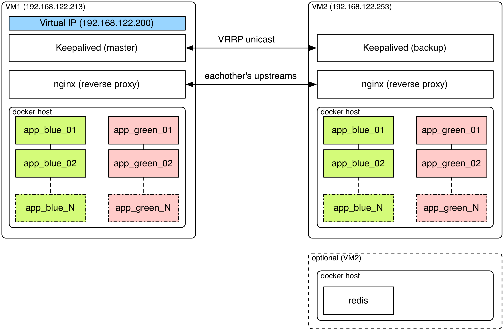

# Ansible Role: ansible-bluegreen-docker

Simple Ansible role showing concept of blue-green deployments on local microinfrastructure with Docker containers

## Role Variables

- `app_bluegreen` - Flag to enable or disable [blue-green deployments](http://martinfowler.com/bliki/BlueGreenDeployment.html) (default: `True`)
- `app_check_health` - Should we check application health in containers before reloading nginx or not. (default: `True`)
- `app_health_check_path` - URL path for health check. (default: `/`)
- `app_command` - Start-up command for container.
- `app_env` - Dictionary of ENV variables to be available in conainer. Used for set-up application in container. (default: `{}`)
- `app_etc_hosts` - Dictionary of custom host:ip mappings for /etc/hosts in container. Used for unified 3rd party services endpoints accross different envs. (default: `{}`)
- `app_hostname` - Hostname used in nginx config as server_name. (default: `localhost`)
- `app_instances_count` - Number of containers to be run on single host. (default: `2`)
- `app_log_driver` - Log driver for docker containers. (default: `none`)
- `app_log_options` - Dictionary with options for docker log driver. (default: `{ tag: {{ app_name }} }`)
- `app_name` - Application name. Used for pulling containers from registry and container naming. (default: `trainingwheels`)
- `app_nginx_port` - Port where nginx balancer is listening to. (default: `80`)
- `app_nginx_ip_hash` - Enable [ip-hash](http://nginx.org/en/docs/http/load_balancing.html#nginx_load_balancing_methods) load-balancing algorithm for nginx. (default: `False`)
- `app_port` - TCP port where app is listening to. Usually it's port in EXPOSE. (default: `5000`)
- `app_stop_inactive_color` - Whether stop inactive instances after successful deployment or not. (default: `True`)
- `app_repo` - Repository in docker registry to take image from.
- `app_version` - Image version to install. (default: `latest`)
- `app_volumes` - Array with volumes mounted in container. Used for storing peristent data. (default: `[]`)

For more variables see [defaults/main.yml](defaults/main.yml)

## Requirements

* docker-engine (not in meta)
* nginx (not in meta)

## Nginx balancing

1. Ansible get a list of all published ports in containers.
2. Ansible prepare a nginx config with all published container's ports of all(!) app hosts.

## Desired architecture

## License

MIT / BSD
